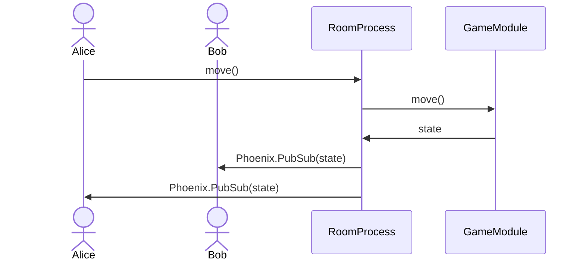

# Playground

Playground for turn-based games.

## Getting started

Installing Elixir and Erlang:

- Recommend using [asdf](https://asdf-vm.com/)
- Add the plugins
  ```
  asdf plugin add elixir
  asdf plugin add erlang
  ```
- Install version listed in `.tool-versions`
  ```
  asdf install
  ```

Setting ENVs

- Install [`direnv`](https://direnv.net/)
- Copy the sample
  ```
  cp .envrc.example .envrc
  ```
- Load the ENV from the `.envrc` file
  ```
  direnv allow
  ```
- Every time changing an env, need to run `direnv allow` again

Run the database

- If using docker
  ```
  docker run --name postgres --env=POSTGRES_PASSWORD=test --env=POSTGRES_DB=playground_dev -p 5432:5432 -d postgres
  ```
- Or any other method works for the DB, set your DB password in `.envrc` and
  then run `direnv allow` again

To start your Phoenix server:

- Run `mix setup` to install and setup dependencies
- Start Phoenix endpoint with `mix phx.server` or inside IEx with `iex -S mix phx.server`

Now you can visit [`localhost:4000`](http://localhost:4000) from your browser.

## Learn more about phoenix

- Official website: https://www.phoenixframework.org/
- Guides: https://hexdocs.pm/phoenix/overview.html
- Docs: https://hexdocs.pm/phoenix
- Forum: https://elixirforum.com/c/phoenix-forum
- Source: https://github.com/phoenixframework/phoenix

## General architecture

Concepts

- Room: a room is a group of players that can play games
- Players: each user in a room is a player
- Game: each room can start one active game at a time

Architecture

- The engine handles creating room, joining room and starting game
- A game defines a few things:
  - Metadata like name, minimum and maximum number of players
  - Initializing the game state
  - Handling the move of each player
  - Component to render the frontend screen with the provided game state
- The engine supports:
  - When a room starts a game, let the game module initialize the game state
  - Forward the game state to the frontend and load the game component
  - Provide metadata like the viewer, getting player name by player id, etc.
  - Forward move actions to the game module
  - Broadcast update of the state to all game component
  - Provide utils function like notification for the game module
  - Persist the game state to the database

When the frontend game component create a move event, the engine forward the
move event to the game module. The game module is expected to return the updated
state of the game. The new state will be broadcast to all the connected client,
and hence, the frontend game component will get and render with the updated game
state.



The idea is with the game engine set, new games can be added easily by defining
the game module and the game component, without the need to handle players,
rooms or anything in the middle. More features can be added to the engine like
Presence.
